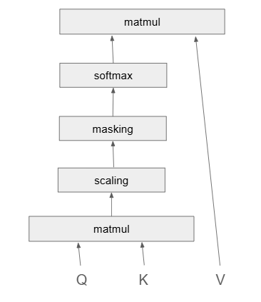

# Generative AI course

## Deep Learning

**Input Layer --> Hidden Layers --> Output Layer**  
(Takes data) --> (Processes data) --> Gives output

While working with any kind of image, image consists of pixels.  
Each pixel value belongs to [0-255] which is shade of that particular colour.

---

### Sequential model

When we want to create a simple sequential one-to-one model.

### Functional API model

When we want to create different architectures model.

---

### Flatten Layer

We cannot directly pass 2D matrix input (like images) into Dense layers, so we flatten them into 1D arrays.
Transforming 2D matrix into flattened layer (1D array).  
In the python function, We need to give it the size of our input matrix.

---

### Dense Layer

When we are using simple architecture of feed-forward network, when neurons are connected to next layer neurons.  
It is fully connected neural network.  
Dense is hidden layer.  
We pass the number of neurons the layer should have.  
We also give activation function here.

**Dense layer is output layer too.**  
Number of neurons in this layer should be same as number of outputs we want.

---

### Activation Function

- **Hidden Layers**: ReLU (adds non-linearity)
- **Output Layer**:
  - **Sigmoid** → Binary classification
  - **Softmax** → Multiclass classification

---


---

### What is "params"?

It refers to the total number of connections (weights) and biases.

Example:

- 784 inputs → 5 neurons: `784 × 5 + 5 (bias)` = **3925**
- 5 neurons → 10 outputs: `5 × 10 + 10` = **60**

**Total trainable parameters** = 3925 + 60 = **3985**

---

### Compilation of model

- **Optimizer:** Loss for single values and how weights are optimized to reduce loss. eg. adam and gradient descent
- **Loss function:** As we are working with categorical data we use `categorical_crossentropy`.  
  Loss is the total loss after all iterations.
  Other examples of loss functions:
  - Binary classification → binary_crossentropy
  - Regression → mean_squared_error, etc.
- For evaluation of model we use **metrics**, eg. accuracy

---

### Model Training (`model.fit()`)

- Pass the training data (`x_train`, `y_train`)
- **Epochs**: Number of complete passes through the dataset (no. of iterations are we gonna perform for the whole dataset.).
  - Each epoch consists of (training samples / batch size) iterations.
- **Batch Size**: Number of samples per training step (e.g., 32)
- **Verbose**: Controls how much training info is displayed

---


**Why 1875 steps per epoch?**  
Total samples / Batch size = `60000 / 32` ≈ **1875**

---

- Model performance is compared based on **loss** (lower is better).
- To evaluate:  
  `model.evaluate(x_test, y_test)` → returns (loss, accuracy)

- To save model:  
  `model.save('name.h5')` → downloads model

- To get model weights:  
  `model.get_weights()`

---

### Architectures of Neural Networks

- **Simple NN**: Use `Sequential Model` with `Dense` layers.
- **Complex NN**: Use layer concatenation and custom architectures.

Example:


---

### Model Summary

`model.summary()` → Gives total params, layers, and output shapes.


---

### Overfitting vs Underfitting

- **Overfitted Model**:  
  High training accuracy, low testing accuracy.

- **Underfitted Model**:  
  Low training accuracy, low testing accuracy.

---

## Generative AI


**GenAI / LLMs:** Based on the given data, they try to generate new data.  
They can work with both labelled and unlabelled data.

### Architecture

**Code / Labelled data / Unlabelled data → Model → Text / Image / Code**

The model has 2 parts:

- **Discriminator**

  - Works with labelled data
  - Identifies whether the input data is real or fake
    - The discriminator evaluates whether the data generated by the generator looks real or fake, based on training on actual real data.

- **Generator**
  - Works with unlabelled data
  - Tries to create new content or data by itself
  - Generator takes noise/unlabelled input and learns to generate realistic data based on feedback from the discriminator.


The content/data generated by the generator is passed to the discriminator,  
which checks if it’s real or fake.  
If marked fake, feedback is given back to the generator for improvement,  
until it generates real-like data.

**GenAI:** A model that can create new content/data by learning from existing data.

> Positional encoding provides information about the relative positions of tokens within input sequences, aiding in capturing token relationships
> Sine and cosine functions are commonly used in the formulation of positional encoding in transformers.

**How does it know what type of data to create?**  
→ It depends on the prompt.

- GenAI needs a huge amount of data and billions of parameters to train.
- **Building Block of GenAI:** Attention Models

#### Attention Models: Use Cases

- **Transformers** → Building blocks of LLMs
- **Diffusion Models** → Used for generating image/video content

---

### Attention Models

- A model that can focus on specific parts of the input data provided by the user and tries to predict what should come next or what should be the output.

**Embedding**: A technique for converting text into meaningful numerics (e.g., Word2Vec).

#### How does Attention Models work?

For a given sentence with `n` words:

- Apply an embedding technique to convert each word into an embedding vector of size (say) 512×1. Let these be: `X1, X2, ..., Xn`.
- These vectors form our input matrix `X`, where each row represents a word:

```
X = [X1; X2; ... ; Xn]
```

- The transpose `Xt` will have these vectors as columns:

```
Xt = [X1 X2 ... Xn]
```

- Multiply `X` and `Xt` and perform normalization:

```
X_new = normalize(X × Xt) → (n × n matrix)
```

**Why normalization?**  
To get values in a fixed range and simplify computation. Normalization is done row-wise so that the sum of all values in a row becomes 1.

> Diagonal values may be high due to self-similarity, but it's not guaranteed.

- `X_new[i][j]` represents the relationship between word `Xi` and word `Xj` — basically, how natural it is for `Xj` to come after `Xi`.  
  This is called the **Self-Attention Mechanism**.

- For the final output:

```
Y = X_new × Xt = [y1, y2, ..., yn]
```

Each output vector (`y1, y2, ...`) now knows its own meaning and its importance with respect to the other words.

> At this stage, we still don't have any trainable parameters like weights or biases.

### Scaled Dot Product Attention

---

#### Single-Headed Self-Attention Model



**Q, K, V**: Query, Key, Value  
These concepts come from database and dictionary design.

- **Query** is the data we're feeding in.
- **Key** and **Value** represent the actual data.

**Architecture**:

```
Att = softmax((Q × Kᵗ) / √dmodel) × V
```

- `Kᵗ` is the transpose of K
- `dmodel` is the size of the embedding

**Steps**:

- `Q` is one of the embedded vectors (say, `X1`)
- Take the dot product of `Q` with all `Kᵗ` values
- This gives scores showing how much the query is compatible with the keys
- Divide scores by `√dmodel` to scale them
- Apply softmax to normalize
- Multiply the result with `V` to get the final output `Y`

**Learnable parameters**

We introduce weights `W`:

```
Q = Wq × X
K = Wk × X
V = Wv × X
```

These allow the model to learn meaningful transformations.

> Q, K, and V are usually projected into a lower-dimensional space (`dk < dmodel`) to reduce computation cost.

**Why is it called single-headed?**  
Because it uses **only one set of weight matrices**:

- **W<sub>q</sub>** (Query)
- **W<sub>k</sub>** (Key)
- **W<sub>v</sub>** (Value)

This means the model captures attention from **a single perspective**.

---

#### Masking

- **Optional**, and only applied in decoders.
- Masking is used during score calculation to prevent a word from attending to future words.
- Compatibility scores for future positions are set to **-∞**.
- During softmax, these get reduced to **zero**, so the current word doesn’t “see” the next one.

---

#### Multi-Headed Attention


To understand a word from **multiple perspectives**—such as:

- **Grammatical role** (noun, verb, adjective)
- **Semantic meaning** (literal or contextual)
- **Position in sentence**

...we use **Multi-Headed Attention**.

In that case:

- We use **multiple sets of weights**, which means we get multiple values of `Q`, `K`, and `V`.
- It's like having **multiple single-headed self-attention layers**, each capturing a different viewpoint.
- The outputs from all these heads are **concatenated**.
- This concatenated output is then passed through a **linear layer** to combine all the learned insights.

So instead of just one perspective (single head), the model learns from **many perspectives in parallel**.

---

### Transformers

Transformers are based on an **encoder-decoder mechanism** for sequence modeling tasks like language translation.

```
Input -> [Encoder, Decoder] (transformer) -> Generative pre-trained -> output
```

---

#### Example: Language Translation

Transformers can translate text from language X to language Y:

- Provide **X** as input to the **Encoder**
- Provide **Y** (previous output/target text) to the **Decoder**
- The model generates the translated output step-by-step

---

#### Input Embedding Pipeline

Transformers require numerical input, so we follow a series of steps:

1. **Tokenization**

   - Converts a sentence into individual tokens (words, subwords, or symbols)

2. **Vocabulary Creation**

   - Creates a fixed index for all tokens in the language

3. **Normalization**

   - Often avoided in NLP, because scaling down values may reduce the semantic importance of rare but meaningful words

4. **Embedding**
   - Maps each token to a dense vector (of fixed dimension) that captures semantic meaning

---

#### Why Transformers Are Fast

- Unlike RNNs that process tokens **sequentially**, transformers can **process all tokens in parallel**
- Input sentences are passed as **a batch of vectors** to the model all at once

This parallelism makes transformers ideal for handling long sequences efficiently.

---

#### Positional Encoding

Transformers can process data **in parallel**, not sequentially.  
The words in a sentence are converted into **vectors**, but what about **positional information**?

**Why Not Just Use Indexing?**

- Using simple indexing would assign large values to later words.
- This might make the model think that **later words are more important**.
- Hence, we avoid **dependency on sentence length**.

Instead, we use **positional vectors** of the **same size** as embedding vectors (e.g., 512).

#### Final Embedded Vector

```
Final embedded vector = position + embedding vector
```

---

## How is the Positional Vector Calculated?

We use **trigonometric functions** to encode position:

- For **even indices (2i)**:  
  `PE(pos, 2i) = sin(pos / 10000^(2i/d))`

- For **odd indices (2i+1)**:  
  `PE(pos, 2i+1) = cos(pos / 10000^(2i/d))`

Where:

- `pos` = actual position in the sentence
- `i` = index of the embedding dimension
- `d` = total embedding dimension

> 💡 **Why alternating sin and cos?**  
> To prevent the entire positional vector from becoming zero and to capture **patterned variations** in positions.

---

## In the Encoder

1. Final embedded vector goes into a **Self-Attention** mechanism.
2. Self-attention computes the importance of each word **relative to others**.
3. Then we apply **normalization** to remove biases present in the input.

---

## In the Decoder

- We use **Masked Multi-Head Attention** to **prevent predicting future words**.
- It ensures that output depends only on **past tokens and the encoder’s output**.

---

## 

---

# GPT Models

**GPT**: Generative Pre-trained Transformers  
These models generate **human-like text**.

---

## GPT-2 (2018–19)

- Trained only on **internet data**
- First large-scale generative model

### Variants:

| Model  | Parameters | Transformer Layers | Dimension |
| ------ | ---------- | ------------------ | --------- |
| Small  | 117M       | 12                 | 768       |
| Medium | 345M       | 24                 | 1024      |
| Large  | 762M       | 36                 | 1280      |
| XL     | 1.5B       | 48                 | 1600      |

### Use Cases:

- Text generation
- Text summarization
- Translation
- Question answering
- Code generation

---

## GPT-3 (2020)

- Up to **175B parameters**
- Max transformer layers: **96**
- Max dimensionality: **12,288**
- Trained on broader and more recent internet and domain-specific data
- Outputs are more **context-aware and semantically meaningful**
- Available as an **API** for fine-tuning

---

## GPT-4

- **Multimodal language model**
- Can process **text, images, videos, and audios**
- Supports very long contexts and better alignment with user intent

---

## Top 10 Topics To Cover Next

1. Weight initialization methods like Xavier and He
2. Residual Networks (ResNet) and skip connections
3. Attention mechanisms — soft and hard attention
4. Transformer architecture — self-attention, multi-head attention, positional encoding
5. Training stabilization techniques — gradient clipping, learning rate scheduling, early stopping
6. Data augmentation — vision and NLP-specific methods
7. Evaluation metrics for NLP — BLEU, ROUGE, Perplexity
8. Autoencoders and variants — denoising, sparse, variational (VAE)
9. GANs — generator-discriminator framework and training tricks
10. Self-supervised and contrastive learning — SimCLR, BYOL, MoCo
