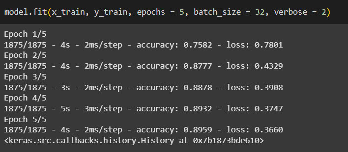

# Generative AI course

## Deep Learning

**Input Layer --> Hidden Layers --> Output Layer**  
(Takes data) --> (Processes data) --> Gives output

While working with any kind of image, image consists of pixels.  
Each pixel value belongs to [0-255] which is shade of that particular colour.

---

### Sequential model

When we want to create a simple sequential one-to-one model.

### Functional API model

When we want to create different architectures model.

---

### Flatten Layer

We cannot directly pass 2D matrix input (like images) into Dense layers, so we flatten them into 1D arrays.
Transforming 2D matrix into flattened layer (1D array).  
In the python function, We need to give it the size of our input matrix.

---

### Dense Layer

When we are using simple architecture of feed-forward network, when neurons are connected to next layer neurons.  
It is fully connected neural network.  
Dense is hidden layer.  
We pass the number of neurons the layer should have.  
We also give activation function here.

**Dense layer is output layer too.**  
Number of neurons in this layer should be same as number of outputs we want.

---

### Activation Function

- **Hidden Layers**: ReLU (adds non-linearity)
- **Output Layer**:
  - **Sigmoid** → Binary classification
  - **Softmax** → Multiclass classification

---


---

### What is "params"?

It refers to the total number of connections (weights) and biases.

Example:

- 784 inputs → 5 neurons: `784 × 5 + 5 (bias)` = **3925**
- 5 neurons → 10 outputs: `5 × 10 + 10` = **60**

**Total trainable parameters** = 3925 + 60 = **3985**

---

### Compilation of model

- **Optimizer:** Loss for single values and how weights are optimized to reduce loss. eg. adam and gradient descent
- **Loss function:** As we are working with categorical data we use `categorical_crossentropy`.  
  Loss is the total loss after all iterations.
  Other examples of loss functions:
  - Binary classification → binary_crossentropy
  - Regression → mean_squared_error, etc.
- For evaluation of model we use **metrics**, eg. accuracy

---

### Model Training (`model.fit()`)

- Pass the training data (`x_train`, `y_train`)
- **Epochs**: Number of complete passes through the dataset (no. of iterations are we gonna perform for the whole dataset.).
  - Each epoch consists of (training samples / batch size) iterations.
- **Batch Size**: Number of samples per training step (e.g., 32)
- **Verbose**: Controls how much training info is displayed

---



**Why 1875 steps per epoch?**  
Total samples / Batch size = `60000 / 32` ≈ **1875**

---

- Model performance is compared based on **loss** (lower is better).
- To evaluate:  
  `model.evaluate(x_test, y_test)` → returns (loss, accuracy)

- To save model:  
  `model.save('name.h5')` → downloads model

- To get model weights:  
  `model.get_weights()`

---

### Architectures of Neural Networks

- **Simple NN**: Use `Sequential Model` with `Dense` layers.
- **Complex NN**: Use layer concatenation and custom architectures.

Example:


---

### Model Summary

`model.summary()` → Gives total params, layers, and output shapes.


---

### Overfitting vs Underfitting

- **Overfitted Model**:  
  High training accuracy, low testing accuracy.

- **Underfitted Model**:  
  Low training accuracy, low testing accuracy.

---

## Generative AI


**GenAI / LLMs:** Based on the given data, they try to generate new data.  
They can work with both labelled and unlabelled data.

### Architecture

**Code / Labelled data / Unlabelled data → Model → Text / Image / Code**

The model has 2 parts:

- **Discriminator**

  - Works with labelled data
  - Identifies whether the input data is real or fake
    - The discriminator evaluates whether the data generated by the generator looks real or fake, based on training on actual real data.

- **Generator**
  - Works with unlabelled data
  - Tries to create new content or data by itself
  - Generator takes noise/unlabelled input and learns to generate realistic data based on feedback from the discriminator.


The content/data generated by the generator is passed to the discriminator,  
which checks if it’s real or fake.  
If marked fake, feedback is given back to the generator for improvement,  
until it generates real-like data.

**GenAI:** A model that can create new content/data by learning from existing data.

**How does it know what type of data to create?**  
→ It depends on the prompt.

- GenAI needs a huge amount of data and billions of parameters to train.
- **Building Block of GenAI:** Attention Models

#### Attention Models: Use Cases

- **Transformers** → Building blocks of LLMs
- **Diffusion Models** → Used for generating image/video content

---

### Attention Models

- A model that can focus on specific parts of the input data provided by the user and tries to predict what should come next or what should be the output.

**Embedding**: A technique for converting text into meaningful numerics (e.g., Word2Vec).

#### How does Attention Models work?

For a given sentence with `n` words:

- Apply an embedding technique to convert each word into an embedding vector of size (say) 512×1. Let these be: `X1, X2, ..., Xn`.
- These vectors form our input matrix `X`, where each row represents a word:

```
X = [X1; X2; ... ; Xn]
```

- The transpose `Xt` will have these vectors as columns:

```
Xt = [X1 X2 ... Xn]
```

- Multiply `X` and `Xt` and perform normalization:

```
X_new = normalize(X × Xt) → (n × n matrix)
```

**Why normalization?**  
To get values in a fixed range and simplify computation. Normalization is done row-wise so that the sum of all values in a row becomes 1.

> Diagonal values may be high due to self-similarity, but it's not guaranteed.

- `X_new[i][j]` represents the relationship between word `Xi` and word `Xj` — basically, how natural it is for `Xj` to come after `Xi`.  
  This is called the **Self-Attention Mechanism**.

- For the final output:

```
Y = X_new × Xt = [y1, y2, ..., yn]
```

Each output vector (`y1, y2, ...`) now knows its own meaning and its importance with respect to the other words.

> At this stage, we still don't have any trainable parameters like weights or biases.

#### Scaled Dot Product Attention

**Q, K, V**: Query, Key, Value  
These concepts come from database and dictionary design.

- **Query** is the data we're feeding in.
- **Key** and **Value** represent the actual data.

**Architecture**:

```
Att = softmax((Q × Kᵗ) / √dmodel) × V
```

- `Kᵗ` is the transpose of K
- `dmodel` is the size of the embedding

**Steps**:

- `Q` is one of the embedded vectors (say, `X1`)
- Take the dot product of `Q` with all `Kᵗ` values
- This gives scores showing how much the query is compatible with the keys
- Divide scores by `√dmodel` to scale them
- Apply softmax to normalize
- Multiply the result with `V` to get the final output `Y`

**Learnable parameters**

We introduce weights `W`:

```
Q = Wq × X
K = Wk × X
V = Wv × X
```

These allow the model to learn meaningful transformations.

> Q, K, and V are usually projected into a lower-dimensional space (`dk < dmodel`) to reduce computation cost.

#### Masking

- **Optional**, and only applied in decoders.
- Masking is used during score calculation to prevent a word from attending to future words.
- Compatibility scores for future positions are set to **-∞**.
- During softmax, these get reduced to **zero**, so the current word doesn’t “see” the next one.
